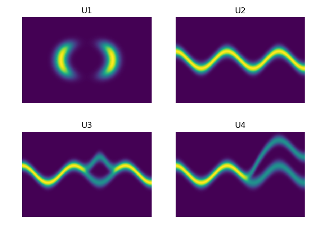
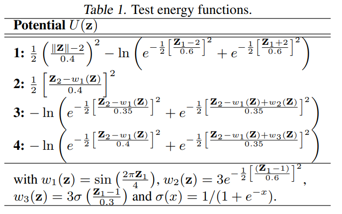
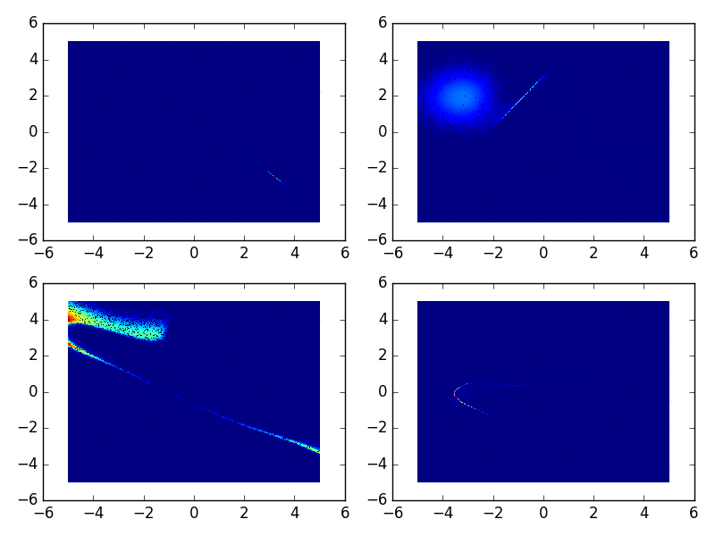
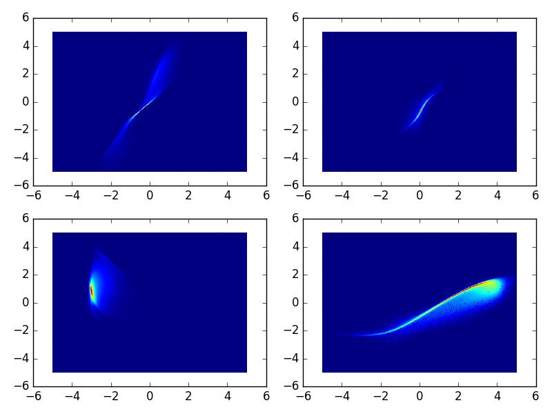
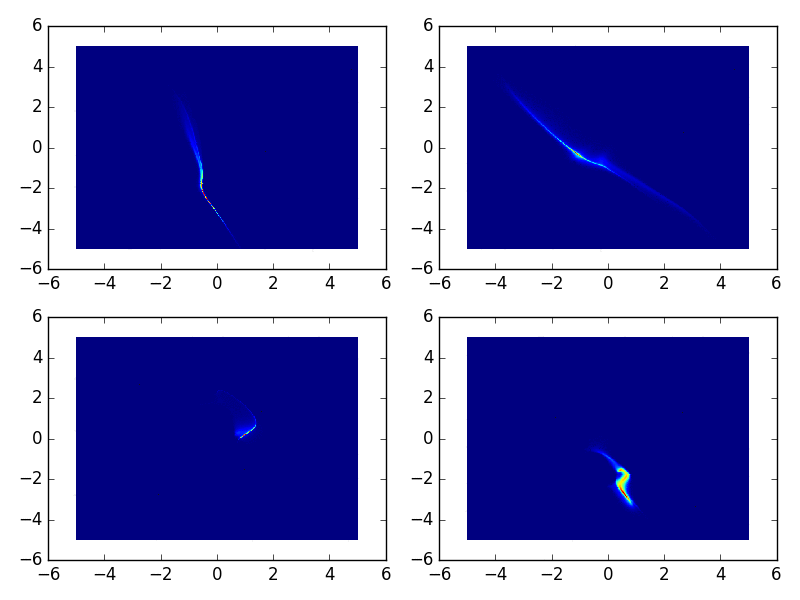
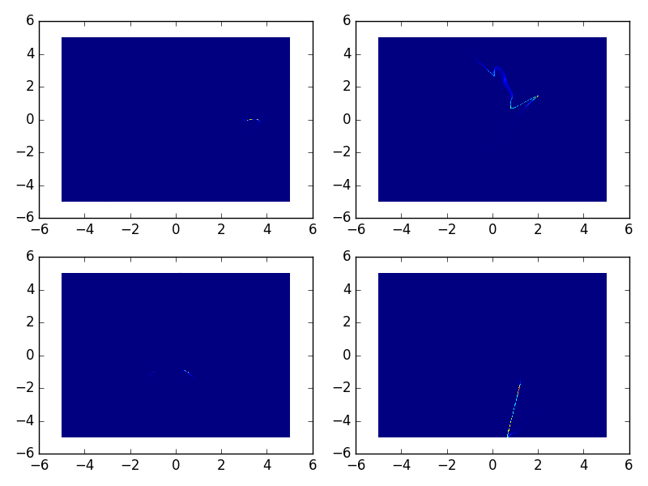

# Variational Inference with Normalizing Flows
Implementation of paper [Variational Inference with Normalizing Flows](https://arxiv.org/abs/1505.05770) section 6.1 experiments.

This experiment visually demonstrates that **Normalizing Flows** can successfully transform a simple 
initial simple distribution q_0(z) to much better approximate some known non-Gaussian Bi-variate 
distribution p(z).

The distributions that we want to learn is as followings:

We want to learning the Bi-variate distribution of Z(Z1, Z2). Equation for each of the distribution could be found at paper.

Then, our **goal** is to transfer some simple distribution to the target distribution by Normalizing Flows.
We will select Normal distribution as the simple distribution and then transfer simple standard Normal distribution to the complex target distribution.

# Experiments Results
This section show the experiments results.
1. K=4

2. K=8

3. K=16

4. K=32

# Training Criteria
The known target distributions are specified using energy functions U(z).
p(z) = \frac{1}{Z} e^{-U(z)}, where Z is the unknown partition function (normalization constant); 
that is, p(z) \prop e^{-U(z)}.

## Steps
1. Generate random samples from initial distribution z0 ~ q_0(z) = N(z; \mu, \sigma^2 I).
   Here \mu and \sigma can either be fixed (such as standard Normal distribution) to something "reasonable", or estimated as follows.
   Draw auxillary random variable \eps from standard normal distribution
     \eps ~ N(0, I)
   and apply linear normalizing flow transformation f(\eps) = \mu + \sigma \eps, re-parameterizing
   \sigma = e^{1/2*log_var} to ensure \sigma > 0, then jointly optimize {mu, log_var} together 
   with the other normalizing flow parameters (see below).
2. Transform the initial samples z_0 through K **Normalizing Flows** transforms, from which we obtain the 
   transformed approximate distribution q_K(z),
     log q_K(z) = log q_0(z) - sum_{k=1}^K log det |J_k|
   where J_k is the Jacobian of the k-th (invertible) normalizing flow transform.
   E.g. for planar flows,
     log q_K(z) = log q_0(z) - sum_{k=1}^K log |1 + u_k^T \psi_k(z_{k-1})|
   where each flow includes model parameters \lambda = {w, u, b}.
3. Jointly optimize all model parameters by minimizing **KL-Divergence** between the approximate distribution q_K(z)
   and the true distribution p(z).
     loss = KL[q_K(z)||p(z)] = E_{z_K ~ q_K(z)} [log q_K(z_K) - log p(z_K)]
                             = E_{z_K ~ q_K(z)} [(log q_0(z_0) - sum_k log det |J_k|) - (-U(z_K) - log(Z))]
                             = E_{z_0 ~ q_0(z)} [log q_0(z_0) - sum_k log det |J_k| + U(f_1(f_2(..f_K(z_0)))) + log(Z)]
   Here the partition function Z is independent of z_0 and model parameters, so we can ignore it for the optimization
     loss = E_{z_0 ~ q_0(z)} [log q0(z0) - sum_k log det |J_k| + U(z_K)]

**The expectation could be approximated by Monte Carlo Sampling, the mini-batch average here could be considered as the
Monte Carlo Sampling Expectation.**

## Another understanding of loss function
### Loss of the Normalizing flow for 6.1, the synthetic data
Let $$p(z)$$ be the true distribution of bivariate distribution.
and, $$z0 \sim q_0(z)$$ is a simple distribution than we already know, then we need to transform this simple distribution by Normalizing Flow to approximate the true distribution $$p(z)$$ that we want to get.

We use KL divergence to measure the distant of our learned distribution with the true distribution.
$$
KL(q_k(z_k)||p(z)) = \\
E_{z_k \sim q_k(z_k)}[logq_k(z_k) - logp(z_k)] = \\
E_{z_k \sim q_k(z_k)}[logq_0(z_0) - sum_k logdet(Jacobian) - (-U(z_K) - log(Z))] = \\
E_{z_0 \sim q_0(z)} [log q_0(z_0) - sum_k log det |J_k| + U(z_k) + log(Z)]
$$

# TODO
* Add IAF

# Reference
[1] Jimenez Rezende, D., Mohamed, S., "Variational Inference with Normalizing Flows", 
Proceedings of the 32nd International Conference on Machine Learning, 2015.

[vae-normflow](https://github.com/16lawrencel/vae-normflow)

[Reproduce results from sec. 6.1 in "Variational inference using normalizing flows" ](https://github.com/casperkaae/parmesan/issues/22)

[parmesan/parmesan/layers/flow.py](https://github.com/casperkaae/parmesan/blob/master/parmesan/layers/flow.py)

[wuaalb/nf6_1.py](https://gist.github.com/wuaalb/c5b85d0c257d44b0d98a)